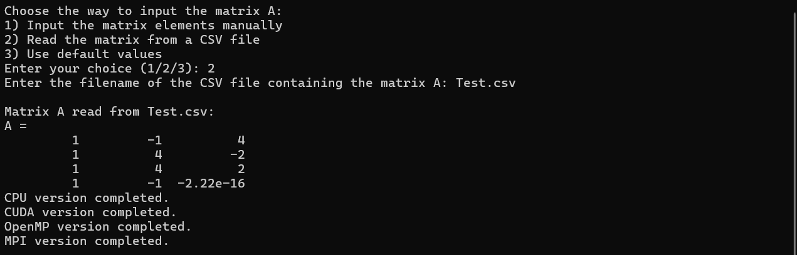
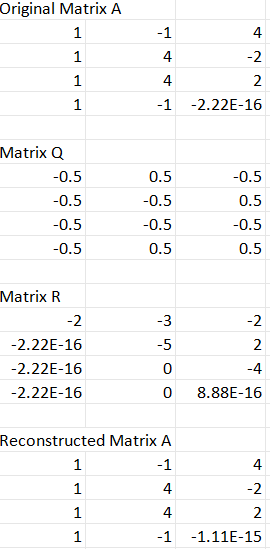
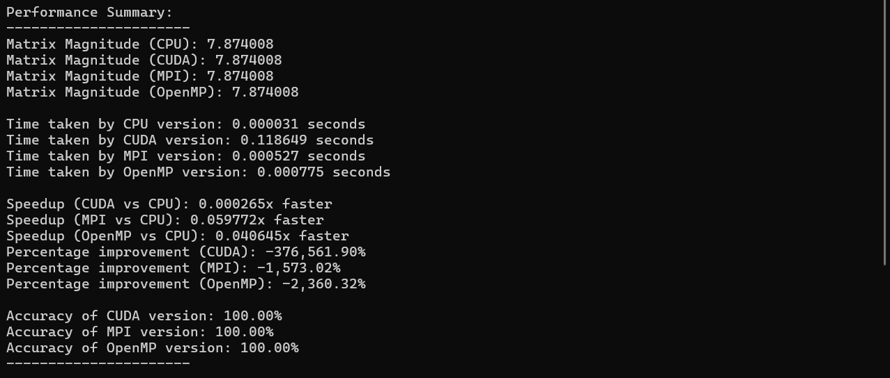
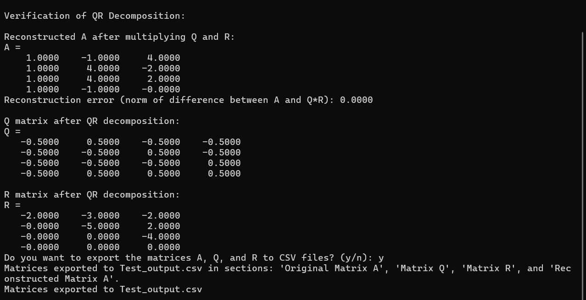

# Parallel QR Decomposition with Householder Method

This project implements **QR decomposition** using the **Householder method** and applies parallel programming techniques to optimize performance. It compares the efficiency of different parallel programming approaches: **CUDA**, **OpenMP**, and **MPI**.

## Table of Contents
- [Project Overview](#project-overview)
- [Features](#features)
- [Technologies Used](#technologies-used)
- [Prerequisites](#prerequisites)
- [Installation](#installation)
- [Usage](#usage)
- [Performance Analysis](#performance-analysis)
- [Result Display](#result-display)
- [Running the Program with Batch File](#running-the-program-with-batch-file)

## Project Overview
This project provides a benchmark for parallel implementations of the QR decomposition using the Householder method. QR decomposition is an important matrix factorization technique used in various numerical methods. By applying **CUDA**, **OpenMP**, and **MPI**, this project compares the computational performance of each parallel programming model for matrix operations, providing a detailed analysis of speedup and accuracy.

## Features
- **CUDA Implementation:** Parallelized version using GPU to perform the decomposition.
- **OpenMP Implementation:** Multi-threaded CPU version using OpenMP to parallelize matrix operations.
- **MPI Implementation:** Distributed memory approach using MPI to parallelize across multiple nodes.
- **Performance Analysis:** Detailed comparison of execution time, speedup, and accuracy for CUDA, OpenMP, and MPI versions.
- **Matrix Reconstruction and Error Calculation:** Verifies the decomposition by reconstructing the original matrix and calculating the error.

## Technologies Used
- **C++**: Core programming language.
- **CUDA**: Used for GPU acceleration.
- **OpenMP**: Multi-threading for CPU parallelism.
- **MPI**: Distributed parallelism across nodes.
- **CUDA Runtime API**: For launching and synchronizing CUDA kernels.
- **OpenMP API**: For multi-threaded parallel programming.
- **MPI Library**: For distributed memory parallel programming.

## Prerequisites
To compile and run this project, you need:
- **CUDA Toolkit**: For compiling CUDA kernels.
- **OpenMP**: For multi-threaded programming (usually included in modern compilers).
- **MPI Library (e.g., MPICH or OpenMPI)**: For message passing.
- **C++ Compiler**: Supporting C++11 or later (e.g., GCC, MSVC).
- **CUDA-capable GPU**: For running the CUDA version.
- **MPI runtime**: To run the MPI version across multiple nodes.

## Installation
1. **Clone the Repository:**
   ```bash
   git clone https://github.com/your-username/ParallelQRDecomposition.git
   cd ParallelQRDecomposition
   ```

2. **Build the Project:**
   Ensure you have CUDA, OpenMP, and MPI installed. Then compile the project using the following command (you may need to adjust compiler options depending on your environment):

   ```bash
   nvcc -o householder_qr householder_qr.cu -fopenmp -lmpi
   ```

3. **Prepare MPI Environment:**
   If you are running the MPI version, make sure MPI is configured correctly in your system, and you have multiple processes available.

## Usage
1. **Run the Program:**
   You can run the program in standalone mode or distributed mode using MPI:

   - For single-machine execution (OpenMP or CUDA):
     ```bash
     ./householder_qr
     ```

   - For distributed execution using MPI:
     ```bash
     mpirun -np <number_of_processes> ./householder_qr
     ```

2. **Input Matrix Options:**
   - Input matrix elements manually.
   - Load the matrix from a CSV file.
   - Use default values.

3. **Export Results:**
   The program gives you an option to export the matrices (Original, Q, R, and Reconstructed) to CSV files for further analysis.

## Performance Analysis
The project compares the performance of the different parallel implementations (CUDA, OpenMP, and MPI) by calculating:
- **Execution Time**: Time taken by each method.
- **Speedup**: Performance gain over the CPU implementation.
- **Accuracy**: Relative accuracy of the results compared to the CPU version.

The output includes a detailed breakdown of these metrics.

## Result Display
Here is an example screenshot of the program's output showing performance comparison, reconstruction error, and speedup calculations:
## Result Display

### 1. Program Input
The image below shows the initial input phase of the program, where the user is prompted to either input the matrix manually, load it from a CSV file, or use default values.



### 2. CSV Output
If the user chooses to export the matrices (Original, Q, R, and Reconstructed), they are saved in a CSV file, which can be used for further analysis. The following screenshot shows the exported CSV output.



### 3. Performance Summary
Once the program has completed the QR decomposition using CUDA, OpenMP, MPI, and CPU, it displays a detailed performance summary. This summary includes the execution time, speedup factors, and accuracy for each method compared to the CPU implementation.



### 4. Result Verification
The program verifies the accuracy of the QR decomposition by reconstructing the original matrix from Q and R. The following screenshot shows the verification process and the reconstruction error, which indicates how closely the reconstructed matrix matches the original.



## Running the Program with Batch File
A batch file is provided to make it easier to run the program with MPI on a Windows system.

### Batch File Content:
```bat
@echo off
set MPIRUN_FLAGS=-np 4
mpiexec %MPIRUN_FLAGS% householder_qr.exe
pause
```

### Steps to Run the Program:
1. **Ensure the batch file is in the same directory as `householder_qr.exe`.**
2. **Double-click** on the batch file to execute the program with MPI using 4 processes (`-np 4` can be changed based on the number of processes you wish to use).
3. The `pause` command ensures the console window remains open until you press a key, allowing you to view the results.
